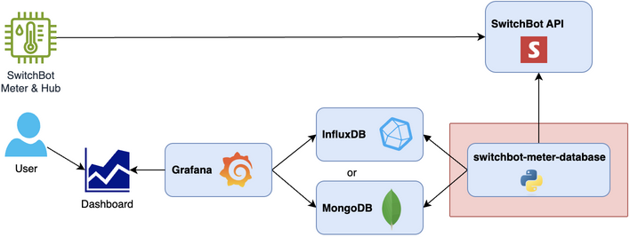
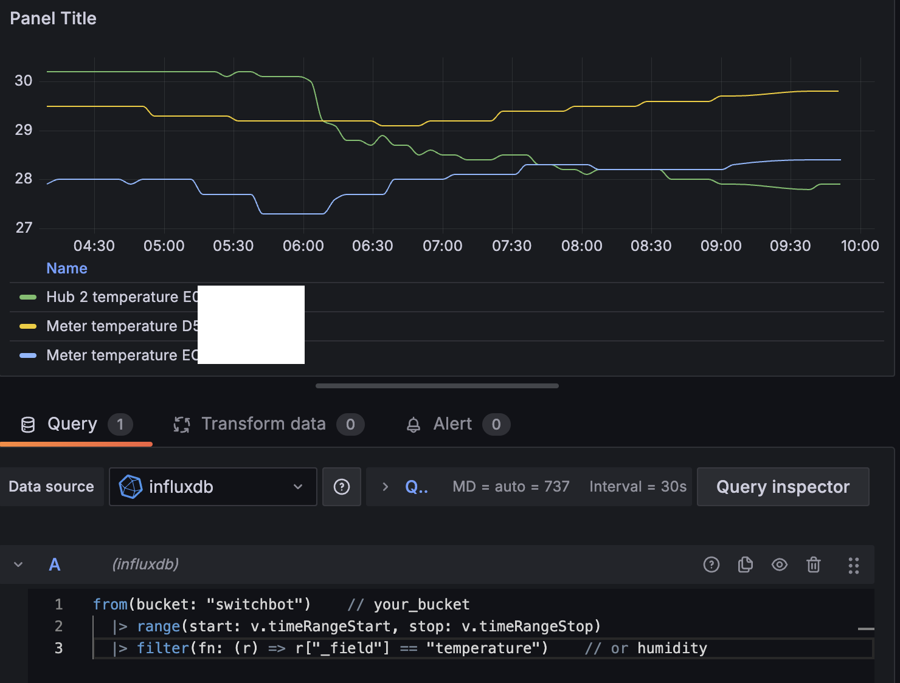

# SwitchBot Meter - InfluxDB/MongoDB

Ingest SwitchBot environmental sensor data into InfluxDB or MongoDB

## Overview



## Supported devices

| name                    | deviceType | remarks    |
|-------------------------|------------|------------|
| SwitchBot Meter         | Meter      |            |
| SwitchBot Meter Plus    | MeterPlus  | not tested |
| SwitchBot Outdoor Meter | WoIOSensor | not tested |
| SwitchBot Humidifier    | Humidifier | not tested |
| SwitchBot Hub 2         | Hub 2      |            |

## Usage

Set environmental variables

### InfluxDB

```sh
export SWITCHBOT_ACCESS_TOKEN=your_switchbot_token
export SWITCHBOT_SECRET=your_switchbot_secret

export DATABASE=influxdb
export INFLUXDB_URL=http://influxdb:8086
export INFLUXDB_ORG=your_org
export INFLUXDB_BUCKET=your_bucket
export INFLUXDB_TOKEN=your_influxdb_token
```

### MongoDB

```sh
export SWITCHBOT_ACCESS_TOKEN=your_switchbot_token
export SWITCHBOT_SECRET=your_switchbot_secret

export DATABASE=mongodb
export MONGODB_URI=mongodb://localhost:27017
export MONGODB_DATABASE=switchbot
export MONGODB_COLLECTION=meter
export MONGODB_USERNAME=switchbot
export MONGODB_PASSWORD=switchbot
```

```sh
$ switchbot-meter-influxdb
```

Log messages

```sh
2025-08-15 20:48:06,606 [INFO    ] main Start
2025-08-15 20:48:06,746 [INFO    ] main Meter devices: {'XXXXXXXXXXXX': 'Meter', 'YYYYYYYYYYYY': 'Hub 2', 'ZZZZZZZZZZZZ': 'Meter'}
2025-08-15 20:48:06,746 [INFO    ] task Processing device: XXXXXXXXXXXX
2025-08-15 20:48:06,897 [INFO    ] put_data Writing Meter to InfluxDB...
2025-08-15 20:48:07,574 [INFO    ] put_data Saved: {'version': 'V3.3', 'temperature': '27.6', 'battery': 100, 'humidity': 55, 'device_id': 'XXXXXXXXXXXX', 'device_type': 'meter', 'hub_device_id': 'YYYYYYYYYYYY'}
2025-08-15 20:48:07,577 [INFO    ] task Processing device: YYYYYYYYYYYY
2025-08-15 20:48:07,676 [INFO    ] put_data Writing Hub 2 to InfluxDB...
2025-08-15 20:48:08,321 [INFO    ] put_data Saved: {'version': 'V2.3-1.4', 'temperature': '27.2', 'light_level': 12, 'humidity': 71, 'device_id': 'YYYYYYYYYYYY', 'device_type': 'hub2', 'hub_device_id': 'YYYYYYYYYYYY'}
2025-08-15 20:48:08,324 [INFO    ] task Processing device: ZZZZZZZZZZZZ
2025-08-15 20:48:08,428 [INFO    ] put_data Writing Meter to InfluxDB...
2025-08-15 20:48:09,097 [INFO    ] put_data Saved: {'version': 'V3.3', 'temperature': '24.5', 'battery': 100, 'humidity': 62, 'device_id': 'ZZZZZZZZZZZZ', 'device_type': 'meter', 'hub_device_id': 'YYYYYYYYYYYY'}
...
```

## Grafana usage

### InfluxDB query

```sql
from(bucket: "switchbot")    // your_bucket
  |> range(start: v.timeRangeStart, stop: v.timeRangeStop)
  |> filter(fn: (r) => r["_field"] == "temperature")    // or humidity
```

### MongoDB query

```javascript
db.switchbot.aggregate([
  {
    $match: {
      "timestamp": {
        $gte: "$__timeFrom",
        $lte: "$__timeTo"
      }
    }
  },
  {
    $group: {
      _id: {
        time: {
          $dateTrunc: {
            date: "$timestamp",
            unit: "minute"
          }
        },
        device_id: "$metadata.device_id"
      },
      value: { $avg: "$temperature" }
    }
  },
  {
    $project: {
      "time": "$_id.time",
      "value": "$value",
      "metric": "$_id.device_id",
      "_id": 0
    }
  },
  {
    $sort: {
      "time": 1
    }
  }
])
```

### Grafana dashboard


